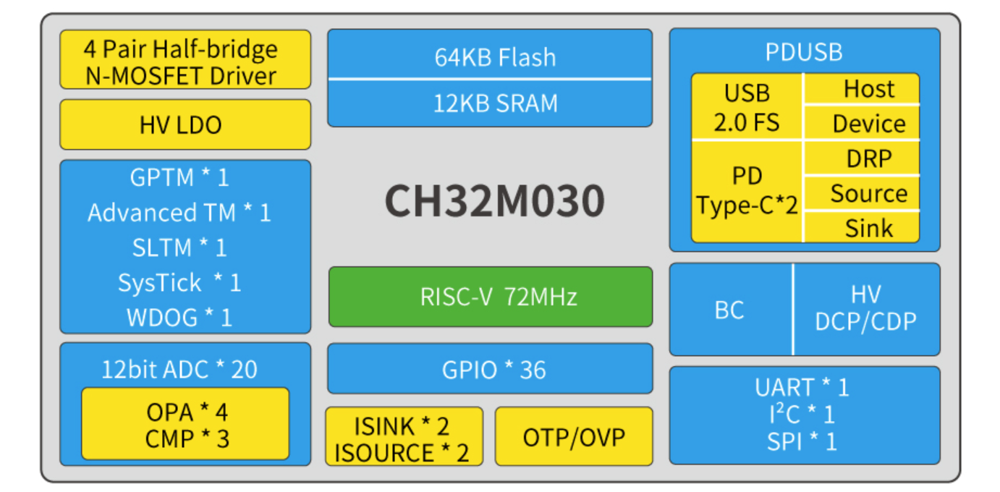

# 工业级电机微控制器 CH32M030

[EN](README.md) | 中文

### 概述

CH32M030是基于青稞RISC-V3B内核设计的工业级电机微控制器。CH32M030内置OPA和CMP,支持组合成2组交流小信号放大解码器QII和2组差分输入电流采样ISP.内置USB PHY和PD PHY，支持USB Host主机和USB Device设备功能、PDUSB、Type-C快充功能、BC1.2及DCP/CDP等多种高压充电协议；内置4对N型功率管栅极预驱，提供高压I/O；内置可编程灌电流模块；提供DMA控制器、12位模数转换ADC、多组定时器、UART串口、I2C、SPI等外设资源，提供过压保护和过温保护。

### 系统框图

### 产品特点

- 青稞32位RISC-V3B内核
- 支持RV32IMAC指令集和自扩展指令
- 高速中断响应机制
- 最高72M系统主频
- 12KBSRAM，64KBCode Flash
- 512B用户自定义信息存储区
- 内置高压LDO，VHV支持额定5～28V系统供电
- 预驱动I/O供电VDD8额定电压：5～10V
- 普通I/0和ADC供电VDD33额定电压：3.3V
- 低功耗模式：睡眠、停止、待机
- 4个双N型MOSFET半桥驱动器
- 内置低压降自举二极管，外部只需要电容
- 可组合为三相电机栅极驱动，可组合为两路独立的全桥驱动
- 内置出厂调校的8MHz的RC振荡器
- 340kHz的RC振荡器，支持外部4～25MHz晶体
- 7路通用DMA控制器，支持TIMx/ADC/UART/I2C/SPI
- 12位模数转换ADC，模拟输入范围：GND～VDD33
- 20路外部信号通道，支持外部延迟触发，支持ADC滑动平均功能
- OTP过温保护和OVP过压保护及欠压复位
- 多引脚映射的UART串口
- I2C接口 ，SPI接口
- 2组Type-C和USB PD控制器及PHY，支持DRP、Sink和Source应用
- 4个耐高压的CC引脚
- 全速USB 2.0控制器及PHY
- 支持PDUSB、Host主机和Device设备模式
- 支持BC1.2及多种HV DCP/CDP充电协议
- 内置6位DAC，可编程电压输出及上下拉
- 1个16位高级定时器，提供死区控制和紧急刹车，提供用于电机控制的PWM互补输出  
- 1个16位通用定时器
- 1个16位的精简通用定时器
- 1个窗口看门狗定时器
- 系统时基定时器：32位计数器
- 4个运放OPA和3个模拟电压比较器CMP可组合为2组交流小信号放大解码器QII1及QII2和2组差分输入电流采样ISP1及ISP2
- OPA1和OPA2支持自偏置的PGA
- OPA3和OPA4支持单端及差分输入，PGA多档增益选择，提供内部自偏置电压
- CMP1支持数字滤波
- CMP2和CMP3支持N端偏置可选，数字滤波
- CMP3有多路输入通道，输出到I/O或者内部
- 2组10位可编程灌电流模块
- 2组源电流模块
- 37个I/O口，映射16个外部中断
- 8个MV预驱动引脚，2个HV高压引脚
- 安全特性：64位芯片唯一ID
- 调试模式：支持单线和双线两种调试模式
- 封装形式：LQFP、QFN、QSOP